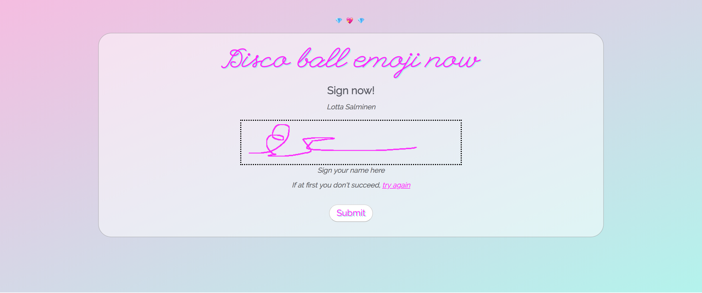

# Discoball emoji now

This full stack JavaScript project collect signatures for a petition to launch an official disco ball emoji. Users register,
go through an on-boarding process, sign the petition using their mouse/touchpad and can see and filter information about other signees.

Technologies used:

Handlebars.js | Node.js/Express.js | Canvas
